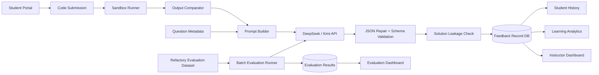
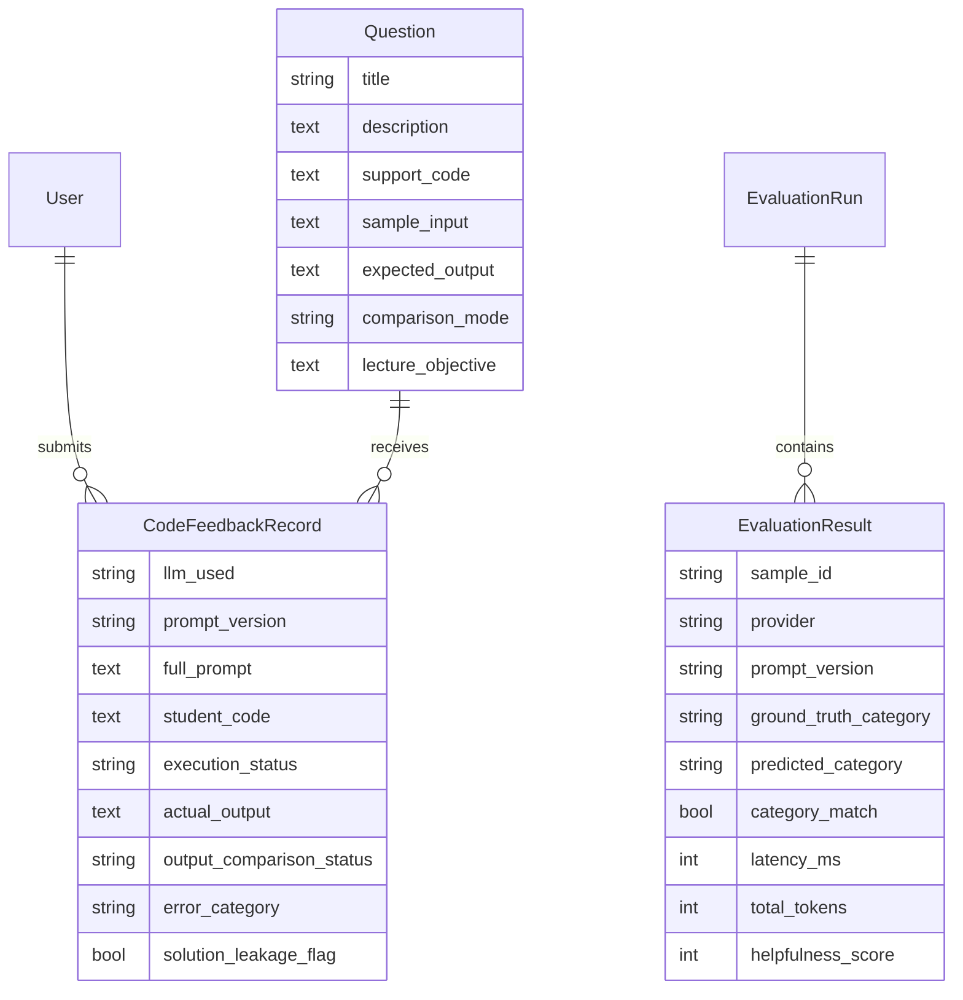

# Day 14 Report Evidence Pack

Revision: 2026-09-30 11:23:28 CST (Asia/Macau)

用途：这个文件用于整理 final report、下周 supervisor demo 和答辩展示的证据链。中文部分帮助你理解要讲什么；英文段落可以作为报告草稿基础，但最终提交前仍需要按学校格式和你的写作风格再润色。

## 1. 当前项目一句话定位

本 FYP 实现了一个面向 Python 初学者的 context-aware AI programming feedback system。系统不只是把学生代码直接发给 LLM，而是先通过 sandbox 执行、输入输出比较、错误状态识别和题目教学上下文构造 runtime evidence，再让 DeepSeek/Kimi 生成结构化、可存档、尽量不泄露完整答案的 formative feedback。教师端可以查看常见错误、学生进度曲线、历史提交和批量评估结果。

英文可用版：

> This project develops a context-aware AI programming feedback system for novice Python learners. Instead of sending student code directly to an LLM, the system first executes the submission in a sandbox, compares actual and expected outputs, records runtime evidence, and combines this evidence with teaching-task metadata. The resulting prompt asks the LLM to produce structured formative feedback rather than a full solution. The system also provides instructor-facing analytics, student progress profiles, and a reproducible evaluation workflow comparing DeepSeek and Kimi under different prompt designs.

## 2. Supervisor/Assessor 需求覆盖矩阵

| 需求或问题 | 当前完成情况 | 报告里怎么写 |
| --- | --- | --- |
| LLM 是否能识别学生常见错误 | 已建立错误 taxonomy，并用 Refactory 真实学生错误样本做 55-sample real LLM evaluation | 写成核心研究问题 RQ1：Can runtime-informed prompting improve error-category identification? |
| 反馈不应直接给完整答案 | schema 包含 `does_reveal_solution`，系统有 leakage detector，Day 12 结果中 automatic leakage rate 和 human-marked leakage rate 都是 0% | 写成 formative feedback design constraint |
| 需要利用 submission history 分析学生理解程度 | 已实现 8-Topic mastery radar、单 Topic attempt timeline、repeated errors、weak/mastered concepts、next-step suggestions | 放在系统设计和 demo 部分，不要把它混到 evaluation dataset accuracy 里 |
| 需要 common errors / class-level analytics | Instructor/Analytics 页面已显示 common error categories、weak concepts、hard questions、recent suggestions | 作为 teacher-facing analytics contribution |
| 需要比较 DeepSeek vs Kimi | Day 12 已完成 330 条真实 API 输出，包含 provider/prompt 拆分指标 | 写成 RQ2：How do provider and prompt design affect accuracy, latency, and cost? |
| 数据不能瞎编，要有来源 | 主评估使用 Refactory 真实学生错误代码；另有 12 条 hand-crafted boundary cases 已单独完成真实 LLM 补充评估 | 明确区分 Day 12 real Refactory records 和 Day 14 supplemental boundary cases |
| UI 中英混杂、不够专业 | Day 8 已完成 English-only UI 和统一视觉风格 | 放在 implementation refinement |
| demo 可复现 | Day 13 已加 README、requirements、`.env.example`、`seed_demo --with-history`、部署安全配置 | 放在 reproducibility subsection |

## 3. 系统设计要点

### 3.1 用户角色

- Student：选择题目，提交 Python 代码，查看反馈和个人历史/进度。
- Instructor：查看班级数据、学生 profile、常见错误、近期反馈、evaluation dashboard，并通过 admin 管理题目。
- Experiment interface：staff-only，用于比较不同 provider/prompt 的反馈结果。

### 3.2 核心数据模型

- `Question`：题目描述、support code、sample input、expected output、comparison mode、teaching objective、difficulty/tags/default provider。
- `CodeFeedbackRecord`：学生代码、runtime output、comparison result、prompt version、完整 prompt、LLM provider/model、结构化反馈、错误类别、token usage、cost、solution leakage flag。
- `EvaluationRun` / `EvaluationResult`：批量实验运行和样本级结果，支持真实 API run、dry-run、去重聚合、AI-assisted human review spot-check。

### 3.3 反馈生成流程

1. 学生选择题目并提交代码。
2. 系统在 sandbox 中执行代码，注入 sample input 或 function harness。
3. 系统比较 actual output 与 expected output，记录 strict/normalized comparison status。
4. prompt builder 生成 baseline、context-aware 或 strict-scaffolded prompt。
5. LLM 返回 JSON feedback，系统进行清洗、repair、schema validation 和 leakage detection。
6. 反馈、metadata、runtime evidence 和 prompt 原文一起落库，供 history、analytics 和 evaluation 使用。

英文可用版：

> The feedback pipeline consists of six stages: submission collection, sandbox execution, output comparison, prompt construction, structured LLM response parsing, and persistent storage. This design makes the feedback traceable: each saved record contains not only the final message shown to the student, but also the runtime evidence, prompt version, full prompt text, provider, model name, token usage, estimated cost, JSON/schema status, and leakage flag.

### 3.4 Human-guided taxonomy design

老师 2026-09-16 的意见要求 Topic 和 Error Category 不能由 LLM 自由创造。Topic 由研究者从 PECI Concepts 中筛选并合并为 8 个项目范围内的固定 Topic；Error Category 则直接采用 PECI Table 1 的 A-X 共 24 个 Programming Errors，不再把项目自行概括的 17 类当成正式文献 taxonomy。

报告可直接使用的英文方法段落：

> The question-topic set was scoped by the researcher from the Programming Concepts in PECI Table 1. For error classification, the system directly adopts the 24 PECI Programming Errors A-X, retaining the literature codes and labels. Researcher-written operational definitions and priority rules are supplied in the prompt so that the LLM selects one existing code rather than inventing a category. Runtime exceptions and output-comparison states are stored as a separate deterministic evidence layer. No Error, Outside PECI Scope, and Unknown are system outcomes rather than PECI errors.

完整参考文献：

> Cooke, N., Hawwash, K. and Smith, B. (2019) 'Python for Engineers Concept Inventory (PECI): Contextualized assessment of programming skills for engineering undergraduates', *Proceedings of the 47th SEFI Annual Conference*, pp. 270-279. doi:10.5281/zenodo.14656194.

引用位置建议：

- Literature Review：介绍 PECI 将 assessment item 组织为 Concepts、Errors 与 context 的组合。
- Methodology / Taxonomy Design：解释 Topic 如何筛选成 8 个固定集合，以及 Error 如何直接采用 A-X。
- Prompt Design：说明 `feedback_schema_v3_peci` 把 A-X、操作性定义和分类顺序提供给 LLM。
- Limitations：说明操作性定义由本 FYP 研究者撰写，尚未经过独立教育专家的大规模验证；A-X 之外的错误会明确标为 `Outside PECI Scope`。

版本边界必须如实写：Day 12 的 330 条输出和 Day 14 boundary run 使用旧 v1/v2 的 17 类 ground truth。它们可以继续证明 runtime evidence 在该实验设计中的效果，但不能被写成对 PECI A-X 的直接验证。当前 A-X 已通过独立 v3 run 验证：55 samples × 2 providers × 1 strict-scaffolded prompt = 110 outputs，overall accuracy 50.00%。

### 3.5 Architecture Diagram Draft

可以在 report 或 presentation 里用下面这张 Mermaid 图改成正式图片：

### 3.6 Database Evidence Diagram Draft

## 4. 数据来源与边界

主评估数据来自 Refactory dataset。当前项目的 `evaluation_dataset_sources.md` 已记录来源链：

- Haque et al. (2025) 的数据集综述中提到 Refactory 可作为 faulty Python student-program dataset。
- 原始 Refactory 来源为 Hu et al. (2019), `Refactory: A Tool for Refactoring Python Programs`, ASE 2019。
- 项目仓库：`https://github.com/githubhuyang/refactory`
- 仓库中的 `data.zip` 说明包含 361 名 NUS 本科学生的 2,442 个 correct 和 1,783 个 buggy program attempts。

当前本地数据边界：

- `evaluation_samples.json` 总共 67 条 selected records。
- 其中 55 条是 real Refactory student submissions。
- 12 条是 hand-crafted boundary cases，用于补充 syntax、indentation、timeout、stdin/input 等 Refactory selected subset 没覆盖到的边界。
- Day 12 最终真实 API headline evaluation 使用的是 55 条 Refactory real samples，不把 hand-crafted cases 混进主指标。
- Day 14 supplemental boundary evaluation 已对这 12 条 boundary cases 单独完成真实 API 评估：12 samples × 2 providers × 3 prompt versions = 72 outputs，最终 API/model error count 为 0。

报告中必须诚实说明：

- Refactory 提供真实学生代码，但不提供本 FYP 使用的 error-category labels。
- `ground_truth_category` 是本项目根据代码检查、首个 failing test、runtime status 和 output comparison 做的人工标注。
- Hand-crafted boundary cases 不能写成真实学生提交，只能写成 supplemental system tests。

英文可用版：

> The main evaluation uses 55 faulty Python submissions selected from the Refactory dataset. The Refactory repository provides real student program attempts, but it does not provide the error-category labels used in this project. Therefore, the ground-truth categories were manually annotated for this FYP by inspecting the code, the first failing test case, the runtime status, and the output comparison. A separate set of 12 hand-crafted boundary cases was created to test syntax, indentation, timeout, and stdin-related behaviours. These cases were evaluated in a separate Day 14 supplemental run and are not mixed into the headline real-student evaluation metrics.

## 5. Day 12 实验设计

### 5.1 Research Questions

- RQ1：加入 runtime evidence 是否提升 LLM 对学生错误类别的识别能力？
- RQ2：DeepSeek 与 Kimi 在错误识别准确率、JSON 合规性、延迟和成本上有什么差异？
- RQ3：更严格的 anti-leakage prompt scaffold 是否能在不降低准确率的情况下减少答案泄露风险？

### 5.2 Prompt Conditions

| Condition | 说明 | 目的 |
| --- | --- | --- |
| baseline | 只给题目、support code、学生代码，不给 runtime evidence | 模拟较普通的 LLM feedback prompt |
| context-aware | 加入 runtime status、actual/expected output、comparison result | 测试 runtime evidence 是否提升错误识别 |
| strict-scaffolded | 在 context-aware 基础上加入更强的 anti-leakage 和 structured-feedback constraints | 测试更严格 scaffold 的收益和副作用 |

### 5.3 Providers

- DeepSeek：`deepseek-chat`
- Kimi：`kimi-k2.7-code-highspeed`

### 5.4 Metrics

- Category accuracy：预测错误类别是否等于 ground truth。
- JSON compliance / usable schema：LLM 输出是否能被系统解析为可用结构。
- Solution leakage rate：反馈是否泄露完整答案或 corrected code。
- Runtime evidence usage rate：反馈是否明确引用 runtime evidence。
- Latency：API 调用耗时。
- Token/cost：记录 prompt/completion tokens，并估算 API 花费。
- AI-assisted human review spot-check：20/330 条输出用于确认 helpfulness、lecture alignment、actionability 和 human solution leakage；这不是独立大规模 human evaluation。

## 6. Day 12 真实结果

最终真实 API run：

- 55 个 Refactory real-student samples。
- 2 个 providers：DeepSeek、Kimi。
- 3 个 prompt versions：baseline、context-aware、strict-scaffolded。
- 共 330 条 model outputs。
- 多次分批运行后聚合 24 个 run，并按 sample/provider/prompt key 去重 80 条重复，保留最新结果。

### 6.1 Condition-level Results

| Provider × Prompt | Accuracy | JSON Compliance | Leakage | Runtime Evidence |
| --- | ---: | ---: | ---: | ---: |
| DeepSeek baseline | 43.6% | 100.0% | 0.0% | 0.0% |
| DeepSeek context-aware | 89.1% | 100.0% | 0.0% | 100.0% |
| DeepSeek strict-scaffolded | 87.3% | 100.0% | 0.0% | 100.0% |
| Kimi baseline | 67.3% | 98.2% | 0.0% | 0.0% |
| Kimi context-aware | 92.7% | 100.0% | 0.0% | 100.0% |
| Kimi strict-scaffolded | 87.3% | 100.0% | 0.0% | 100.0% |

### 6.2 Aggregated Results

- Overall category accuracy：77.88%。
- Prompt-level accuracy：baseline 55.5% → context-aware 90.9% → strict-scaffolded 87.3%。
- Provider-level accuracy：Kimi 82.4%，DeepSeek 73.3%。
- JSON compliance：99.7%，只有 1 条 invalid JSON。
- Automatic solution leakage：0%。
- Average latency：DeepSeek 约 6.5s，Kimi 约 10.2s。
- Estimated final retained API cost：约 USD 1.38–1.72。
- AI-assisted human review spot-check：20/330 条输出（6.06%）；helpfulness 4.20/5，lecture alignment 4.20/5，actionability 4.45/5，human-marked leakage 0%。

### 6.3 主要结论

1. Runtime evidence 是最明显的增益来源。baseline 平均准确率为 55.5%，context-aware 提升到 90.9%，说明把实际运行错误、expected/actual output 和 comparison status 放进 prompt 能显著提升错误识别。
2. Kimi 的准确率更高，但延迟和成本更高。Kimi 82.4% vs DeepSeek 73.3%，但 Kimi completion 更长，成本约为 DeepSeek 的数倍。
3. strict-scaffolded 没有进一步提升准确率。它的准确率为 87.3%，略低于 context-aware 的 90.9%；这说明 anti-leakage 约束有教育价值，但可能带来轻微准确率 trade-off。
4. Function Error 是最弱类别。18 条 Function Error 只有 2 条预测正确，常被误分到 Logic Error、Type Error 或 Conceptual Error。
5. Logic Error 是过宽类别。大量 Condition、Index、Name、Function 错误会被吸入 Logic Error，说明后续 taxonomy 需要继续细分。

### 6.4 Day 14 Supplemental Boundary Evaluation

这部分是补充评估，不改写 Day 12 的主实验 headline。它的目的只是验证系统和 taxonomy 对 Refactory selected subset 中缺少的边界类型也能处理。

- Dataset：12 条 hand-crafted boundary cases。
- Design：12 samples × 2 providers × 3 prompt versions = 72 real LLM outputs。
- Source runs：#37、#38、#39；Kimi 因 RPM 和一次 invalid JSON 进行慢速补跑与单条重试，最终按 sample/provider/prompt key 去重。
- Overall category accuracy：83.33%。
- JSON compliance：100%。
- Solution leakage：0%。
- Runtime evidence usage：66.67%。
- Final AI/API error count：0。
- Report wording：写作时称为 supplemental hand-crafted boundary evaluation，不能写成真实学生数据。

英文可用版：

> The results show that runtime evidence is the most important factor in improving error-category identification. The baseline prompts achieved 55.5% accuracy on average, while the context-aware prompts achieved 90.9%. This supports the project’s central claim that sandbox-derived evidence, such as runtime status and output comparison, can substantially improve the diagnostic quality of LLM-generated feedback. Kimi achieved higher overall accuracy than DeepSeek (82.4% vs. 73.3%), but with higher latency and substantially higher estimated cost. The strict-scaffolded prompt did not improve accuracy over the context-aware prompt, suggesting a trade-off between additional safety constraints and diagnostic precision.

### 6.5 Current PECI A-X Independent Evaluation

这次实验复用同一批 55 条 Refactory 代码，但没有把旧 Day 12 label 机械映射成 A-X。Ground truth 由 LLM 提议后经研究者确认，正式措辞为 `researcher-confirmed AI-assisted A-X annotation`。

- Design：55 samples × 2 providers × 1 current strict-scaffolded prompt = 110 outputs。
- Final database run：`#43`。
- Overall A-X accuracy：50.00%（55/110）。
- DeepSeek：41.82%（23/55），0 output/API errors。
- Kimi：58.18%（32/55），6 output/API errors。
- JSON repair：1 attempt，1 success；剩余错误为 3 empty responses + 3 read timeouts。
- Leakage：0%。
- Scope finding：26/55 samples 在 PECI A-X 内；29/55 为 `Outside PECI Scope`。

这组结果证明固定文献 taxonomy 已真正接受独立测试，也暴露其边界：PECI 对 syntax/naming/structure mistakes 较有效，但无法覆盖许多 semantic logic errors。该 50.00% 不能与 Day 12 的 77.88% 直接比较。

## 7. 图表和证据文件

报告建议放这些图：

- Accuracy by condition：`evaluation_reports/day12_deepseek_kimi_refactory_55_final_real_llm_accuracy_by_condition.svg`
- Quality rates：`evaluation_reports/day12_deepseek_kimi_refactory_55_final_real_llm_quality_rates.svg`
- Ground-truth distribution：`evaluation_reports/day12_deepseek_kimi_refactory_55_final_real_llm_ground_truth_distribution.svg`
- Confusion matrix：`evaluation_reports/day12_deepseek_kimi_refactory_55_final_real_llm_confusion_matrix.svg`

报告建议引用这些文件：

- Final summary：`evaluation_reports/day12_deepseek_kimi_refactory_55_final_real_llm_summary.md`
- AI-assisted human review spot-check：`evaluation_reports/day12_ai_assisted_human_review_final_20.csv`
- Cost estimate：`evaluation_reports/day12_api_cost_estimate.md`
- Dataset provenance：`evaluation_dataset_sources.md`
- Boundary final summary：`evaluation_reports/day14_boundary_cases_real_llm_final_summary.md`
- Boundary charts：`evaluation_reports/day14_boundary_cases_real_llm_final_*.svg`
- Current PECI A-X summary：`evaluation_reports/peci_ax_evaluation_summary.md`
- Current PECI A-X confusion matrix：`evaluation_reports/peci_ax_evaluation_confusion_matrix.csv`
- Current PECI A-X confirmed ground truth：`evaluation_reports/peci_ax_ground_truth_confirmed.csv`
- Reproducibility/deployment：`README.md`

已生成系统截图：

截图生成说明：这些截图来自临时启动的最新代码服务器 `http://127.0.0.1:8002/`，截图文件本身不依赖该端口。Day 15 或正式 demo 前，如果浏览器页面出现旧模板/URL 报错，应先重启 Django server，确保加载的是最新代码。

| Screenshot | File | 报告用途 |
| --- | --- | --- |
| Login page | `report_assets/screenshots/01_login_page.jpg` | 展示 demo accounts 和角色入口 |
| Instructor Dashboard | `report_assets/screenshots/02_instructor_dashboard.jpg` | 展示 common error categories、provider defaults、recent records |
| Analytics Dashboard | `report_assets/screenshots/03_analytics_dashboard.jpg` | 展示 weak concepts、hard questions、student profile trend overview |
| Evaluation Dashboard | `report_assets/screenshots/04_evaluation_dashboard.jpg` | 展示 Day 12 final run、automatic metrics、human review metrics、sample-level evidence |
| Student Profile, instructor view | `report_assets/screenshots/05_student_profile_instructor_view.jpg` | 展示教师查看单个学生 progress |
| Student Portal | `report_assets/screenshots/06_student_portal.jpg` | 展示题目选择、sample input、expected output、comparison mode |
| Student own progress | `report_assets/screenshots/07_student_own_progress.jpg` | 展示学生自己的 attempt trend 和 next-step suggestions |
| Feedback history detail | `report_assets/screenshots/08_student_feedback_history_detail.jpg` | 展示 runtime status、expected vs actual output、AI feedback、original student code 和 stored metadata |

## 8. 建议报告章节结构

1. Introduction
   - 初学者编程错误常见，传统 automated assessment 只能告诉对错，普通 LLM feedback 可能不稳定或泄露答案。
   - 本项目目标：构建一个 runtime-informed、teacher-aware、history-aware 的 AI feedback system。

2. Literature Review
   - Programming misconceptions and novice errors。
   - Automated programming assessment and feedback。
   - LLMs in computing education。
   - Dataset/evaluation issues, including Refactory。

3. Requirement Analysis
   - Student needs：具体、可操作、不直接给答案、能看到历史。
   - Instructor needs：常见错误、学生进度、题目难点、评估证据。
   - Supervisor feedback 对应的需求矩阵。

4. System Design
   - Architecture diagram：Django app, sandbox runner, output comparator, prompt builder, LLM client, analytics/evaluation modules。
   - Database schema。
   - Prompt versions。
   - Role-based UI。

5. Implementation
   - Student portal。
   - Sandbox and comparison modes。
   - JSON schema validation and leakage detection。
   - Instructor analytics。
   - Evaluation commands and reproducibility。

6. Evaluation
   - Dataset source and annotation。
   - Experiment design。
   - Metrics。
   - Results table and charts。
   - AI-assisted human review spot-check。
   - Cost/latency。

7. Discussion
   - Runtime evidence improves feedback diagnosis。
   - Provider trade-off。
   - Strict scaffold trade-off。
   - Taxonomy limitations。
   - Ethical/privacy boundary。

8. Conclusion and Future Work
   - 完成系统和真实评估。
   - 未来：更大 dataset、真实课堂 user study、better taxonomy、multi-test-case evaluation、public staging。

## 9. 下周 Meeting Demo 顺序

建议 8–10 分钟 demo：

1. 先讲一句目标：This semester I completed the second-half design by turning the prototype into a full context-aware feedback and evaluation system.
2. 打开 Student Portal：展示题目选择、sample input/expected output、提交代码。
3. 展示 Result/History：指出 runtime status、expected vs actual output、feedback、original student code、metadata。
4. 打开 Instructor Dashboard：展示 common error categories、recent records、question management overview。
5. 打开 Analytics：展示 class common errors、weak concepts、hard questions、student profile trend。
6. 打开 Evaluation Dashboard：先展示 Day 12 的 runtime-evidence 增益，再展示 current A-X 50.00% 与 29/55 outside-scope limitation。
7. 最后说 next step：final report writing, presentation polishing, and supervisor-requested refinements after feedback。

中文准备回答：

> 我现在已经基本完成了系统设计和主要实现，包括学生端提交、runtime evidence、LLM 结构化反馈、教师端 analytics、学生进度曲线、可复现 seed 数据和 DeepSeek/Kimi 的真实 API 评估。接下来我主要会把 final report 和 presentation 中的实验结果、系统截图、局限分析整理完整。下周我可以准备一个 demo，和老师进一步讨论哪些结果和页面需要放进最终报告。

英文准备回答：

> I have almost completed the main system design and implementation. The current version includes the student submission workflow, sandbox-based runtime evidence, structured LLM feedback, instructor analytics, student progress profiles, reproducible demo data, and a real DeepSeek/Kimi evaluation. For next week, I can prepare a demo and discuss which results, screenshots, and limitations should be emphasised in the final report and presentation.

## 10. 答辩可能被问到的问题

| 问题 | 建议回答方向 |
| --- | --- |
| 你的数据是真实学生数据吗？ | 代码来自 Refactory 真实学生提交；Day 12 是旧 taxonomy 标注，A-X ground truth 是 researcher-confirmed AI-assisted annotation；12 条 hand-crafted 只作为边界测试。 |
| 为什么不用真实 MPU 学生数据？ | 没有伦理审批和隐私授权，所以不使用真实本校学生数据。 |
| 为什么 context-aware 更好？ | 因为它给了 LLM 具体失败证据，例如 traceback、actual/expected output、comparison status，减少模型猜测。 |
| strict scaffold 为什么没有更好？ | 严格规则降低答案泄露风险，但可能限制模型解释空间；结果显示它略低于 context-aware，这是一个诚实的 negative result。 |
| Human review 是否是真人大规模评估？ | 不是。报告里要写成 AI-assisted human review spot-check：20/330 条输出（6.06%）由 AI 草拟评分、人工确认/修正，用于初步检查 helpfulness/alignment/actionability，不是 independent human annotation 或大规模 user study。 |
| Function Error 为什么差？ | Function Error 定义与 Logic/Type/Conceptual Error 有重叠，需要进一步细分 taxonomy 或增加标注指南。 |
| 为什么当前 A-X 只有 50%？ | 29/55 个真实样本是 PECI 24 类没有覆盖的语义逻辑错误；in-scope 表现明显更好，主要问题是 taxonomy scope，而不是只看一个总准确率。 |
| 系统能否上线？ | 当前最稳是 local demo；Day 13 已加入环境变量、安全配置和部署说明，公开部署需要 HTTPS、secret、host、数据库等配置。 |

## 11. Day 14 完成标准

- 报告主线已明确：context-aware runtime evidence improves diagnostic feedback。
- 数据来源与 hand-crafted 边界已明确区分。
- Day 12 真实指标已整理成报告表格。
- Day 14 supplemental boundary evaluation 已补跑完成，72 条真实 LLM 输出、0 API/model error。
- AI-assisted human review spot-check 的范围和限制已说明。
- 下周 meeting demo 讲法已准备。
- 8 张系统截图已保存到 `report_assets/screenshots/`。
- 最终报告章节结构、图表清单和可能问题已整理。
